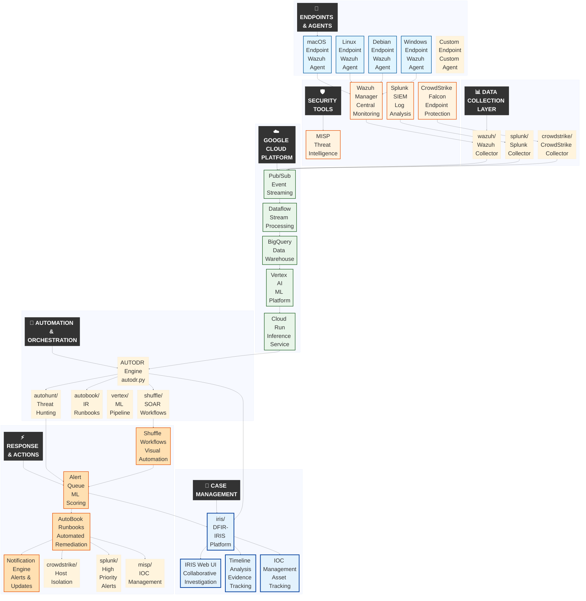

# AUTODR: Automated Threat Hunting & Incident Response System with Vertex AI

**AUTODR** is an ML-powered security orchestration and automated response platform that unifies threat detection, hunting, investigation, and remediation into a single cohesive system. By integrating industry-leading security tools—Wazuh and MISP (optionally Splunk and CrowdStrike)—with Google Vertex AI machine learning, Shuffle SOAR orchestration, and DFIR-IRIS case management, AUTODR transforms reactive security operations into proactive, intelligent defense.

## Core Capabilities

### AI-Powered Threat Detection

AUTODR leverages **Google Vertex AI** for advanced machine learning that enhances detection accuracy and reduces false positives:

- **Anomaly Detection**: Unsupervised learning identifies unusual patterns in network traffic, user behavior, and system activity
- **Threat Classification**: Multi-class supervised models assign precise threat scores (0–1 probability) to alerts and events
- **Real-Time Inference**: Cloud-based model deployment via Cloud Run enables sub-second threat scoring at scale
- **Multi-Source Feature Engineering**: Unified data integration from Wazuh, Splunk, and CrowdStrike for comprehensive visibility
- **Intelligent Response Triggering**: ML confidence thresholds drive automated remediation workflows
- **Continuous Learning**: Models retrain on new threats and incorporate analyst feedback

### Comprehensive Data Collection

- **Multi-Source Integration**: Unified collection from Splunk SIEM, CrowdStrike Falcon EDR, and Wazuh XDR
- **Custom Agent**: Bespoke Developed Agent that cand be adjusted and used to collect data and perform actions on bespoke OS or infrastructure
- **Real-Time Streaming**: Google Cloud Pub/Sub and Dataflow for high-throughput event processing
- **Data Normalization**: Standardized schema across all security sources for consistent analysis
- **BigQuery Data Lake**: Centralized storage enabling historical analysis and model training

### Automated Response & Orchestration

- **Incident Response Automation**: Pre-built runbooks for endpoint isolation, IP blocking, user account management, and threat containment
- **Shuffle SOAR Integration**: Visual workflow designer with 100+ app integrations for complex security orchestration
- **Zero-Touch Remediation**: Automated response actions triggered by ML confidence thresholds
- **MITRE ATT&CK-Mapped Playbooks**: Extensive collection of response procedures aligned with attack frameworks

### Collaborative Investigation

AUTODR integrates **DFIR-IRIS** for multi-analyst investigation workflows:

- **Collaborative Case Management**: Role-based access control with multi-user investigation workspaces
- **Evidence Chain of Custody**: Forensic-grade artifact tracking and timeline analysis
- **IOC Management**: Automatic indicator extraction, tracking, and MISP synchronization
- **Team Coordination**: Task assignment, shared notes, and real-time collaboration

**Integration Pipeline**: `Detect (Wazuh) → Orchestrate (Shuffle) → Investigate (IRIS)`

### Threat Intelligence Integration

- **MISP Platform**: Bi-directional threat intelligence sharing and enrichment
- **Automated IOC Enrichment**: Real-time lookups for file hashes, IPs, domains, and URLs
- **Community Intelligence**: Access to global threat intelligence feeds and indicator sharing
- **Custom Intel Feeds**: Support for proprietary and third-party threat intelligence sources

### Enterprise Architecture

- **Modular Design**: Easily extensible with new hunts, runbooks, data sources, and integrations
- **Cloud-Native Scalability**: Leverages Google Cloud Platform for horizontal scaling and high availability
- **Multi-Platform Support**: Unified security operations across Windows, Linux, macOS, and cloud workloads
- **API-First Design**: RESTful APIs for all components enable custom integrations
- **Containerized Deployment**: Docker Compose orchestration for simplified deployment and management

## System Architecture



## Modules


### AutoBook: Incident Response Modules

Sample runbooks (also available at [github.com/st-mn/autobook](https://github.com/st-mn/autobook)):

- `00_wannacry_ir_runbook.ipynb` — Wannacry Incident Response Automation


### AutoHunt: Threat Hunting Modules

Sample hunts (also available at [github.com/st-mn/autohunt](https://github.com/st-mn/autohunt)):

- `00_wannacry_hunt.py` — Wannacry Threat Hunt Automation


## Run Specific Workflows

### ML Pipeline Operations

**Run Complete ML Pipeline**

```bash
python ml_pipeline.py
```

**Collect Data from Security Sources**

```bash
python splunk_data_collector.py      # Splunk
python crowdstrike_data_collector.py # CrowdStrike
python wazuh_data_collector.py       # Wazuh
```

**Process and Train ML Model**

```bash
python data_normalizer.py        # Normalize collected data
python feature_engineering.py    # Extract features
python vertex/ml_model.py        # Train ML model
```

### Threat Hunting & Incident Response

**List and Run Hunts**

```bash
python autodr.py --list-hunts           # List available hunts
python autodr.py hunt 00_dns_tunneling  # Run specific hunt
```

**List and Run Runbooks**

```bash
python autodr.py --list-runbooks                      # List available runbooks
python autodr.py runbook 00_isolate_endpoint --step   # Run stepwise
python autodr.py runbook 00_isolate_endpoint --full   # Run full automation
```

### Automated Response Testing

```bash
python crowdstrike/crowdstrike_response.py  # Test CrowdStrike integration
python splunk/splunk_alert.py               # Test Splunk alert creation
python misp/misp_integration.py             # Test MISP IOC addition
```

---

© 2026 Stan Toman
